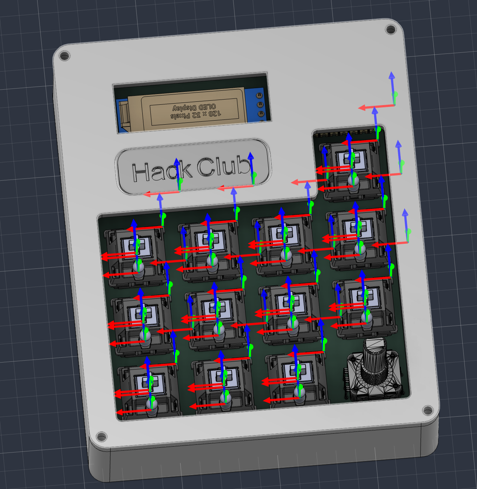

# Hack Club Stardance Hackpad

A sleek hackpad made for the Hack Club Stardance YSWS.

By: Darsh Shah ([@Anycircle11139s](https://github.com/Anycircle11139s)) or @NotALarp on slack

## Overview

I created a custom macropad with 12 keys, an OLED screen, and a rotary encoder. I built it because I wanted to get into Stardance and see how it works, and a hackpad is the perfect way to do that. I designed a custom, sleek case to fit around the PCB, and learned about different types of fillets, like tangent (G1) and curvature (G2). Building this taught me a lot about product design.

## Features

- OLED display
- 12 Cherry MX switches
- Rotary encoder
- Xiao RP2040 microcontroller
- Custom 3D printable case

## Build Steps

1. Order all the parts and 3D print the case.
2. Solder all the parts onto the PCB.
3. Place the PCB inside the case and screw on the lid.
4. Flash the firmware and enjoy!

## Firmware

- Framework: [KMK](https://github.com/KMKfw/kmk_firmware) (CircuitPython)
- Notes: Simple to flash. The OLED display shows "Hackpad", each key acts as a number key (1-12), and the rotary encoder controls volume.

Firmware files and pin mapping are in the [`firmware/`](./firmware) folder.

## Hardware

KiCad schematic, PCB layout, and Gerbers are in the [`hardware/`](./hardware) folder. 3D-printable case files are in the [`enclosure/`](./enclosure) folder. Renders and schematic/PCB screenshots are in [`images/`](./images).

## Bill of Materials

A CSV version is also available at [`BOM.csv`](./BOM.csv).

| Part | Qty | Cost Each | Notes |
|---|---|---|---|
| 0.91" OLED Display | 1 | $0.00 | From Stardance hackpad kit |
| 1N4148 diodes | 12 | $0.00 | From Stardance hackpad kit |
| Cherry MX switches | 12 | $0.00 | From Stardance hackpad kit |
| Rotary encoder | 1 | $0.00 | From Stardance hackpad kit |
| Keycaps | 12 | $0.00 | From Stardance hackpad kit |
| Xiao RP2040 microcontroller | 1 | $0.00 | From Stardance hackpad kit |
| 3D Printed Enclosure | 1 | $0.00 | Printed by Printing Legion |
| M3 Screws | 4 | $0.00 | From Stardance hackpad kit |
|PCB | 1 | $5.50 | From JLCPCB |

Total estimated cost: $5.50

## License

This project is licensed under the MIT License — see [`LICENSE`](./LICENSE) for details.
